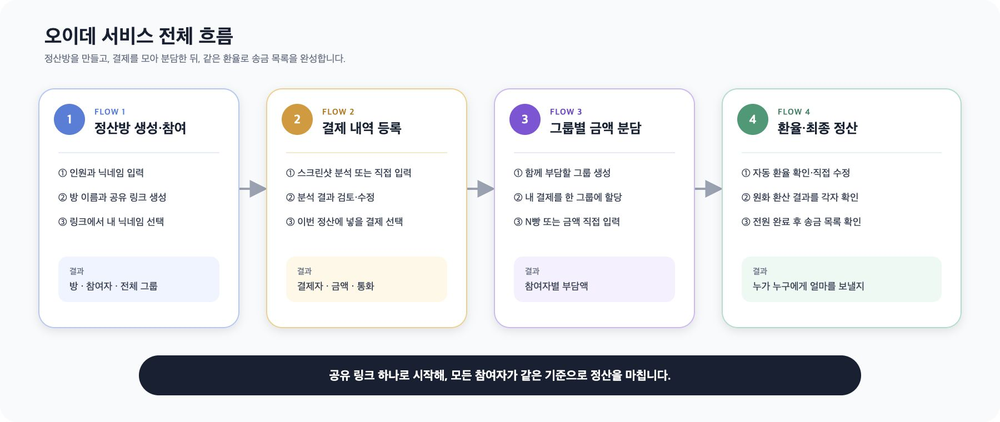
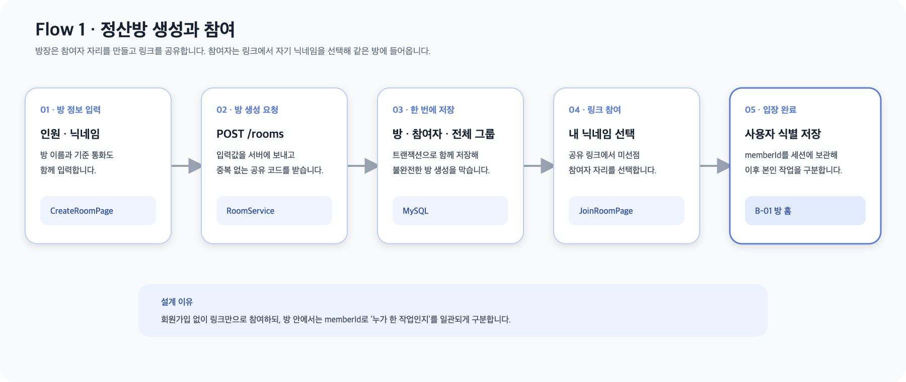
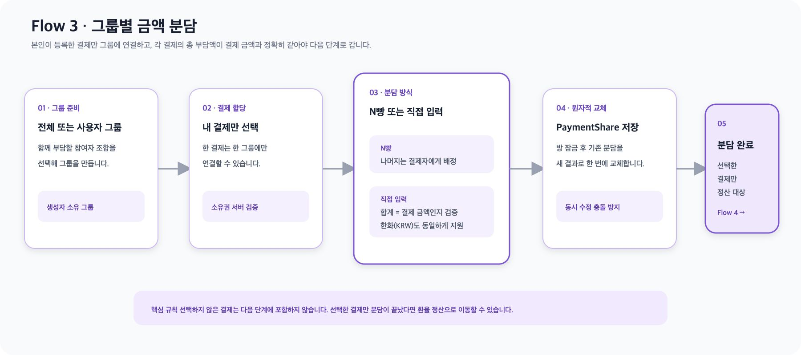
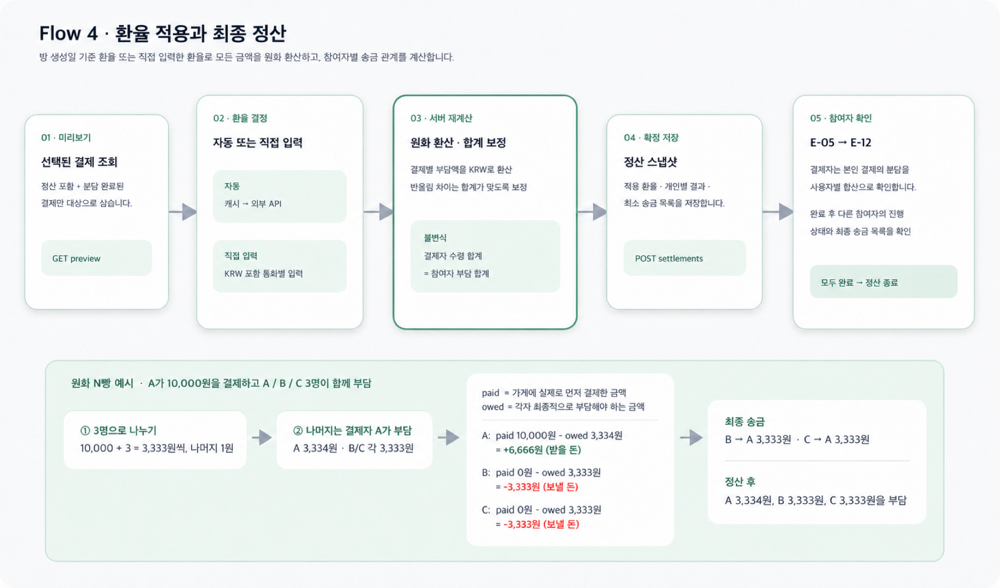

## 서비스 설명

## 시연 영상

https://github.com/user-attachments/assets/6b01215b-98de-4fad-baf8-11b5f163adde

## Tech Stack

| 구분 | 기술 |
|---|---|
| Frontend | React 19, TypeScript 5.9, Vite 7, React Router 7, CSS Modules, Orval |
| Backend | Java 21, Spring Boot 4.1, Spring Data JPA, MySQL 8.4, springdoc-openapi, Lombok, JUnit 5 |
| Infra / CI·CD | GitHub Actions, AWS S3 + CloudFront, EC2|

## 서비스 아키텍처

## ERD

## known issues
### 1. 동일 프로필 접속 문제
- 여러 클라이언트가 동일한 프로필로 접속할 수 있는 문제는 인지하고 감내했다.
- 발생할 수 있는 상황은 두 가지였다.
  1. 이미 정산이 완료된 프로필로 접속하는 경우 
  2. 현재 정산 중인 프로필로 접속하는 경우
- 1번의 경우에는 개인 정산 완료 화면("내 정산이 완료되었어요")으로 리다이렉트시켜, 현재 정산이 완료된 프로필임을 확인하게 했다.
- 2번의 경우에는 정상적인 서비스 플로우를 이용할 수 있도록 했다. 내가 등록하지 않은 결제 내역이 추가될 수는 있지만, 해당 문제가 발생했다면 사용자가 이상을 감지할 수 있는 상황이기 때문이다.
- 이렇게 대처한 이유는, 두 경우 모두 UX 관점에서 거의 발생하지 않을 상황이라고 판단했기 때문이다.
  - 일반적으로 프로필 이름을 사람에 대응시키기 때문이다.

### 2. 정산 화면에서 공용 정산 내역이 보이는 문제
- 정산 화면에서 공용 정산 내역이 보이는 문제를 인지했지만, 코드 프리즈로 인해 수정하지 못했다.
- 초기 기획상 개인이 업로드한 결제 목록에 대한 정산 내역만 보여주는 것을 의도했고, 테스트 과정에서 발견했으나 이를 해결할 충분한 시간을 확보하지 못했기 때문이다.
- 정합성 문제(가령 팀원의 전체 최종 정산 결과가 변한다든지)가 있었다면 코드 프리즈 이후에 수정했겠지만, 치명적인 결함은 아니라고 판단하여 코드 프리즈 이후 수정하지 않았다.

## 서비스 흐름

오이데는 **정산방을 만들고 → 결제 내역을 모으고 → 함께 부담할 사람을 정하고 → 환율을 적용해 송금 목록을 만드는** 여행 정산 서비스입니다.

| Flow | 사용자가 하는 일 | 시스템이 만드는 결과 |
|---|---|---|
| **1. 정산방 생성·참여** | 인원과 닉네임을 등록하고 링크를 공유해 본인을 선택합니다. | 정산방, 참여자, 공유 코드, 기본 `전체` 그룹 |
| **2. 결제 내역 등록** | 결제 스크린샷을 분석하거나 직접 입력한 뒤 정산할 항목을 고릅니다. | 결제자·통화·금액이 포함된 `Payment` |
| **3. 그룹별 금액 분담** | 결제를 함께 부담할 그룹에 담고 N빵 또는 직접 입력으로 나눕니다. | 결제별 그룹·분담 방식·참여자별 `PaymentShare` |
| **4. 환율·최종 정산** | 환율과 원화 환산 결과를 확인하고 각자 정산을 완료합니다. | 환율 스냅샷, 참여자별 정산 결과, 최종 송금 목록 |

<strong>Flow 1 — 정산방 생성과 링크 참여</strong>

### 사용자 흐름

1. 정산 인원 수를 정하고 참여자 닉네임을 입력합니다.
2. 방 이름을 입력하면 공유 링크가 만들어집니다.
3. 링크를 받은 참여자는 목록에서 자기 닉네임을 선택합니다.
4. 선택한 정보는 현재 브라우저 탭에 기억되고 정산방 홈으로 이동합니다.

### 구현 방법

- 생성 화면의 입력은 `CreateRoomDraftProvider`가 React 상태와 `sessionStorage`에 함께 보관합니다. 화면을 오가거나 새로고침해도 작성 중인 값이 유지됩니다.
- `RoomService#createRoom`은 방 이름과 닉네임을 검증하고, `SecureRandom`으로 소문자·숫자 6자리 `shareCode`를 발급합니다.
- 방, 참여자, 기본 `전체` 그룹은 하나의 트랜잭션에서 저장됩니다. 일부만 저장된 방이 만들어지지 않습니다.
- 방은 별도 만료 컬럼 없이 `createdAt + 7일`과 현재 시각을 비교해 접근 가능 여부를 판단합니다.
- 로그인 대신 `useLocalIdentity`가 방별 `memberId`와 닉네임을 브라우저 세션에 저장합니다.

### 왜 이렇게 구현했나요?

- 여행 중 별도 회원가입 없이 링크만으로 빠르게 참여시키기 위해 공유 코드와 로컬 신원 선택 방식을 사용했습니다.
- `전체` 그룹은 대부분의 정산에서 사용하므로 방을 만들 때 함께 생성해 Flow 3의 기본값으로 제공합니다.
- 단, 현재 신원은 서버가 인증한 값이 아니라 브라우저 세션 값입니다. 탭을 닫거나 저장소가 초기화되면 닉네임을 다시 선택해야 합니다.

<strong>Flow 2 — 스크린샷 분석과 결제 내역 등록</strong>

### 사용자 흐름

1. 결제 내역을 스크린샷 분석 또는 직접 입력으로 추가합니다.
2. 스크린샷 방식은 분석 결과를 확인하고 누락된 통화·날짜·결제처를 수정합니다.
3. 최종 등록 후 내 결제 목록에서 이번 정산에 포함할 항목을 선택합니다.

### 구현 방법

- 업로드 API는 분석이 끝날 때까지 연결을 유지하지 않고 `202 Accepted`와 `jobId`를 즉시 반환합니다. 프론트엔드는 최대 5분 동안 700ms 간격으로 상태를 조회합니다.
- 이미지는 별도 실행기에서 병렬 분석됩니다. 한 이미지가 실패해도 성공한 이미지의 결과는 유지됩니다.
- `ExtractionPostProcessor`는 모델 출력에 규칙을 적용합니다.
  - 금액이 없는 행은 등록 후보에서 제외합니다.
  - 연도가 없는 날짜는 방 생성 시점과 7일 유효기간을 기준으로 추론합니다.
- 스크린샷 결과와 직접 입력은 모두 `PaymentCommandService#register`로 합쳐집니다. 서버에는 사용자가 최종 확인한 값만 `Payment`로 저장됩니다.
- 결제 금액은 원 통화의 `BigDecimal`로 보관하며, 원화 환산은 Flow 4까지 미룹니다.

### 왜 이렇게 구현했나요?

- OCR·AI 분석은 응답 시간이 길고 이미지마다 실패 가능성이 달라 비동기 작업과 폴링으로 분리했습니다.
- 모델이 추론한 값을 바로 저장하면 그럴듯한 오류가 확정 데이터가 될 수 있어 사용자 검토를 반드시 거칩니다.
- 추출 방식과 직접 입력 방식의 저장 경로를 하나로 만들어 이후 그룹 분담과 정산 로직이 입력 출처를 알 필요가 없게 했습니다.

<strong>Flow 3 — 그룹 생성과 결제별 부담액 확정</strong>

### 사용자 흐름

1. 방 생성 시 만들어진 `전체` 그룹을 사용하거나 일부 참여자만 포함한 그룹을 만듭니다.
2. 자신이 결제한 항목을 한 그룹에 담습니다.
3. 결제마다 N빵 또는 직접 입력으로 참여자별 부담액을 확정합니다.
4. 어느 그룹에도 넣지 않은 결제는 D-12에서 이번 정산 대상에서 제외할 수 있습니다.

### 구현 방법

- `Payment`가 nullable `split_group_id` 하나를 가지므로 한 결제는 동시에 한 그룹에만 속할 수 있습니다.
- `PaymentShare`는 결제 한 건에 대해 참여자별 원 통화 부담액을 저장합니다. `(payment_id, member_id)` 조합은 중복될 수 없습니다.
- 사용자 지정 그룹은 만든 사람만 수정·삭제하고 자신의 결제만 할당할 수 있습니다. 프론트엔드도 `전체` 그룹과 본인이 만든 그룹만 표시합니다.
- `N빵`을 선택하면 결제 금액을 인원수대로 똑같이 나눕니다. 나누어떨어지지 않고 남는 금액은 결제한 사람에게 더합니다. 결제자가 그룹에 없다면 목록에서 가장 앞에 있는 사람이 부담합니다.
- `직접 입력`을 선택하면 그룹원 모두의 부담액을 입력해야 합니다. 음수는 입력할 수 없고, 입력한 금액의 합계가 결제 금액과 같아야 저장됩니다.
- 그룹원이 바뀌면 `N빵` 금액은 새 인원수에 맞춰 다시 계산됩니다. 직접 입력한 금액은 합계가 그대로 맞으면 유지하고, 맞지 않으면 자동으로 `N빵`으로 다시 계산합니다.
- 그룹·결제·분담 변경은 방 행을 비관적으로 잠가 같은 방에서 동시에 수정할 때 저장 순서가 뒤섞이는 것을 막습니다.

### 왜 이렇게 구현했나요?

- 숙소·택시·식사처럼 같은 참여자 조합이 반복되므로 결제마다 사람을 다시 고르지 않고 그룹을 재사용합니다.
- 결제가 그룹을 직접 참조하게 해 이중 배정 여부를 단순하게 판별합니다.
- 분담 합계가 결제 금액과 다르면 Flow 4의 전체 채권·채무가 맞지 않으므로 저장 시점과 최종 정산 시점에 모두 검증합니다.
- 선택하지 않은 결제를 자동으로 임의 그룹에 넣지 않고 사용자가 제외 여부를 확인하게 해 의도하지 않은 정산을 막습니다.

<strong>Flow 4 — 환율 적용, 완료 확인과 송금 목록</strong>

### 사용자 흐름

1. 방 생성일 기준 자동 환율과 정산 대상 그룹·결제·통화를 확인합니다.
2. 필요한 경우 통화별 환율을 직접 입력합니다.
3. 환율이 반영된 참여자별 부담 금액을 확인하고 `내 정산 완료하기`를 누릅니다.
4. E-12에서 다른 참여자의 완료 상태를 기다립니다.
5. 전원이 완료하면 누가 누구에게 얼마를 보낼지 최종 송금 목록을 확인합니다.

### 구현 방법

- 자동 환율 기준일은 `SettlementRoom.createdAt`의 날짜입니다. 주말·공휴일처럼 고시가 없으면 최대 10일 전까지 가장 최근 환율을 찾습니다.
- KRW는 외부 조회 없이 `1 KRW = 1 KRW`인 `FIXED` 환율을 사용합니다. 외화는 수출입은행 환율을 **외화 1단위당 KRW**로 정규화합니다.
- 직접 입력한 `MANUAL` 환율은 같은 통화의 자동 `EXIM` 환율보다 우선합니다.
- 확정 요청은 프론트엔드의 계산 결과를 받지 않고 서버가 `Payment`와 `PaymentShare`를 다시 읽어 검증·계산합니다.
- 결제 총액은 `HALF_UP`으로 원 단위 반올림합니다. 개별 부담액은 먼저 내림한 뒤 남은 원을 소수부가 큰 참여자부터 1원씩 배정해 합계를 보존합니다.
- 참여자별로 `paidKrw - owedKrw`를 계산하고, 보낼 사람과 받을 사람을 `displayOrder` 순서로 연결해 결정적인 송금 목록을 만듭니다.

#### 정산 계산 예시

A, B, C가 각각 결제하고 A, B, C, D, E 다섯 명이 모든 결제를 함께 부담한다고 가정합니다.

| 결제자 | 결제 내용 | 결제 금액 |
|---|---|---:|
| A | 숙소 | 50,000원 |
| B | 식사 | 30,000원 |
| C | 교통 | 20,000원 |
| **합계** |  | **100,000원** |

총 100,000원을 5명이 함께 부담하므로 각자의 `owedKrw`는 20,000원입니다. `paidKrw`는 각 참여자가 가게에 실제로 먼저 결제한 금액을 모두 더한 값입니다.

| 참여자 | `paidKrw` — 먼저 결제한 금액 | `owedKrw` — 최종 부담할 금액 | `paidKrw - owedKrw` | 정산 결과 |
|---|---:|---:|---:|---|
| A | 50,000원 | 20,000원 | +30,000원 | 30,000원을 받아야 함 |
| B | 30,000원 | 20,000원 | +10,000원 | 10,000원을 받아야 함 |
| C | 20,000원 | 20,000원 | 0원 | 주고받을 금액 없음 |
| D | 0원 | 20,000원 | -20,000원 | 20,000원을 보내야 함 |
| E | 0원 | 20,000원 | -20,000원 | 20,000원을 보내야 함 |
| **합계** | **100,000원** | **100,000원** | **0원** | 받을 금액과 보낼 금액이 일치 |

양수는 받을 금액, 음수는 보낼 금액입니다. 참여자 표시 순서가 A → B → C → D → E라면 보낼 사람과 받을 사람을 순서대로 연결합니다.

| 순서 | 보내는 사람 | 받는 사람 | 송금액 |
|---:|---|---|---:|
| 1 | D | A | 20,000원 |
| 2 | E | A | 10,000원 |
| 3 | E | B | 10,000원 |

송금이 끝나면 다섯 명 모두 20,000원씩 부담한 상태가 되어 전체 결제 금액 100,000원과 정확히 일치합니다.

- 확정 결과는 방당 하나의 `Settlement`에 환율 스냅샷, 참여자 결과, 송금 목록으로 저장됩니다. 재확정하면 상세 결과를 새 계산으로 교체합니다.
- 이미 완료한 사용자가 `수정하기`를 누르면 완료 상태를 먼저 취소한 뒤 Flow 3으로 이동합니다. 수정·재확정 후 다시 결과를 확인하지 못하는 반복 이동을 방지하기 위한 동작입니다.

### 왜 이렇게 구현했나요?

- 한 방에 같은 기준일 환율을 적용하면 모든 참여자가 같은 값으로 검산할 수 있습니다.
- 미리보기에서 확인한 자동 환율을 캐시하고 확정 시 외부 API를 다시 호출하지 않아, 확인한 값과 저장된 값이 달라지는 것을 막습니다.
- 최종 결과를 서버에서 다시 계산해 클라이언트 조작이나 Flow 3 변경이 잘못된 정산으로 저장되지 않게 합니다.
- 환율과 정산 결과를 스냅샷으로 보관해 외부 환율 캐시가 바뀌어도 이미 확정된 결과를 유지합니다.
- 송금 매칭은 최소 송금 횟수 최적화보다 같은 입력에서 항상 같은 결과가 나오는 단순하고 재현 가능한 방식을 선택했습니다.

### 현재 제약

- 로그인·토큰 인증이 없고, 사용자가 선택한 `memberId`를 브라우저 세션에서 신원으로 사용합니다.
- 스크린샷 분석 작업은 30분 TTL의 인메모리 저장소를 사용하므로 서버 재시작이나 다중 인스턴스 환경에서는 작업이 이어지지 않습니다.
- 정산방은 생성 후 7일이 지나면 접근할 수 없습니다.
- 방당 확정 정산은 한 건만 유지하며, 재정산하면 이전 상세 결과를 새 결과로 교체합니다.

## 구성원

| [양용찬](https://github.com/yongchan08) | 김한나 | [채주혁](https://github.com/Juhye0k) | [김재완](https://github.com/tukjw) | [주민석](https://github.com/emes-g) |
| :---: | :---: | :---: | :---: | :---: |
| 기획 | 기획 | 개발 | 개발 | 개발 |
